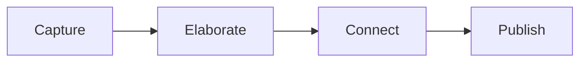

# Note-Writing System

A framework for transforming note-taking from passive storage into an active instrument of thought. Based on the Zettelkasten method developed by Niklas Luhmann and extended through contemporary research in knowledge management.

## Principles

1. **Notes are the fundamental unit of knowledge work.** The metric that matters is concept notes produced per day.

2. **Atomicity.** Each note addresses a single concept. This enables precise linking and unlimited recombination.

3. **Concept orientation.** Notes are organized by idea, not by source. A note on entropy connects thermodynamics, information theory, and machine learning regardless of origin.

4. **Dense linking.** The web of connections constitutes the organizational structure. Each note links to two or more related notes with explicit context explaining the relationship.

5. **Declarative titles.** Note titles are complete sentences expressing a claim. This allows ideas to be referenced by name and abstracted into larger structures.

## Workflow

### Capture
- Maintain a single writing inbox for transient and incomplete notes
- Maintain a reading inbox for references
- Process the inbox regularly

### Elaborate
- Convert fleeting notes to explicit, atomic form within 24 hours
- Write as though addressing another person: future context will not be recoverable from memory
- Summarize each note's content in its title

### Connect
- Link from existing notes to new notes, building on established infrastructure
- Explain why each link exists: context outlasts the connection itself
- Create structure notes that freeze thought trails for indefinite development

### Output
- Speculative outlines are constructed by arranging note titles
- Writing becomes an editorial process: the thinking was completed during note creation

## References

- Luhmann, N. (1992). Communicating with Slip Boxes.
- Ahrens, S. (2017). *How to Take Smart Notes*.
- Berners-Lee, T. (1989). Information Management: A Proposal.
- Bush, V. (1945). As We May Think. *The Atlantic*.
